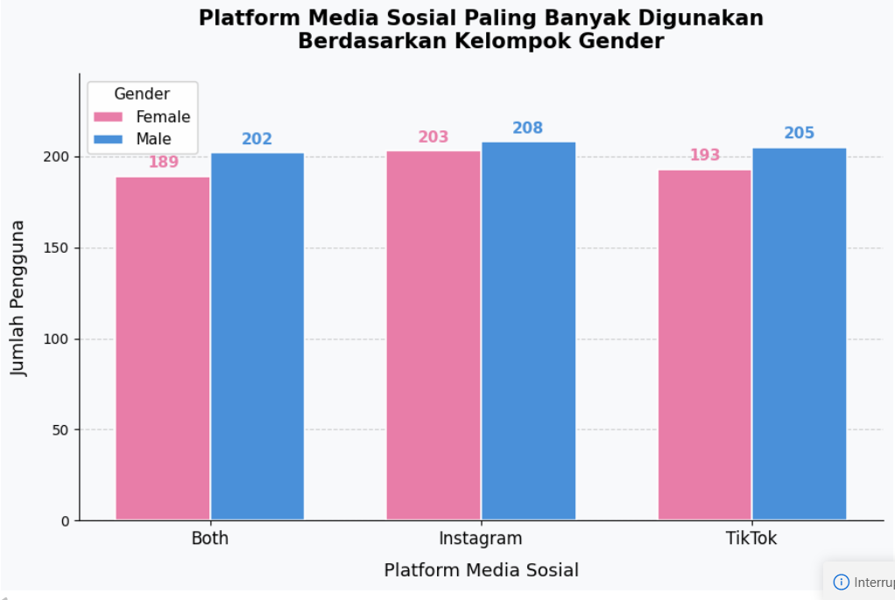
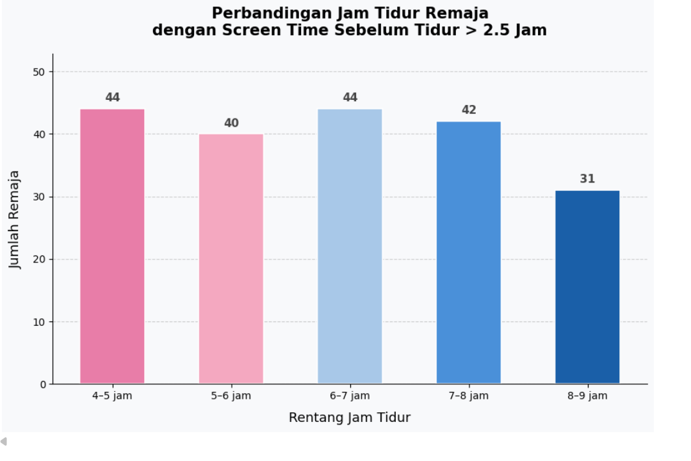
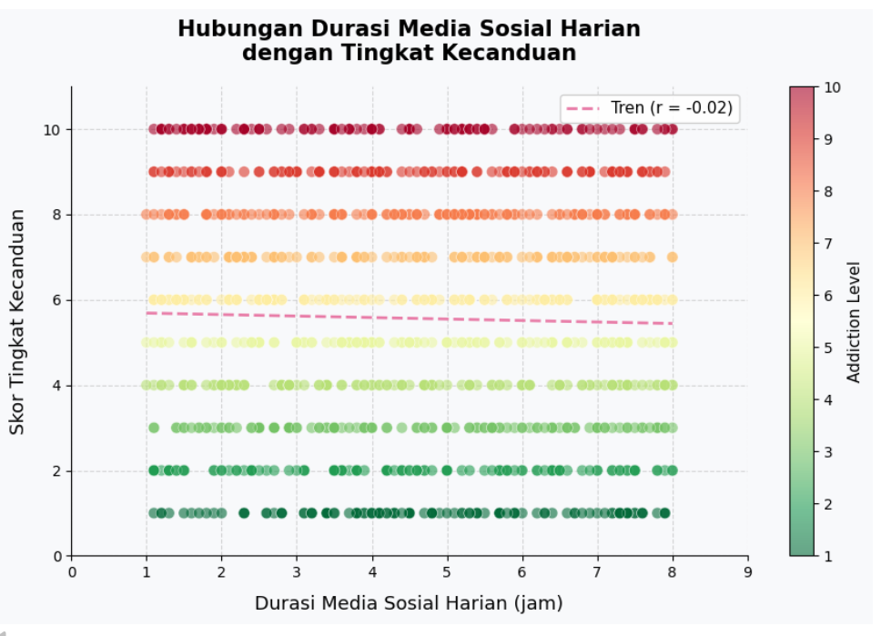
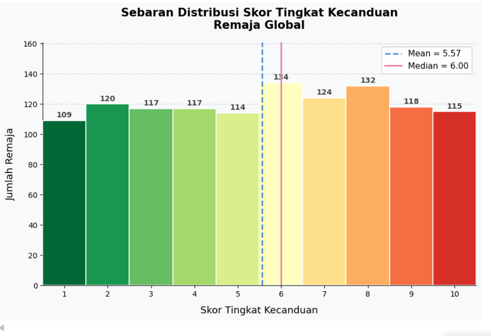
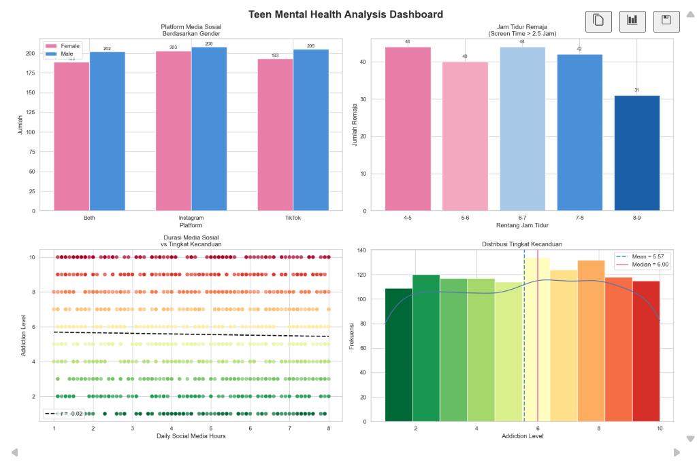

# 📊 Analisis Kesehatan Mental Remaja & Penggunaan Media Sosial

Proyek analisis data yang mengeksplorasi hubungan antara kebiasaan penggunaan media sosial dengan tingkat kecanduan dan pola tidur remaja secara global.

---

## 📁 Dataset

**File:** `Salinan Kelas E_Teen Mental Health.csv`

Dataset berisi data remaja global mencakup variabel-variabel berikut:

| Kolom | Deskripsi |
|---|---|
| `gender` | Jenis kelamin (`female` / `male`) |
| `platform_usage` | Platform media sosial yang paling banyak digunakan |
| `daily_social_media_hours` | Durasi penggunaan media sosial per hari (jam) |
| `screen_time_before_sleep` | Durasi layar sebelum tidur (jam) |
| `sleep_hours` | Total jam tidur per malam |
| `addiction_level` | Skor tingkat kecanduan media sosial (skala 1–10) |

---

## 📌 Deskripsi Analisis

Notebook ini terdiri dari **4 visualisasi utama**:

### 1. 📱 Platform Media Sosial Berdasarkan Gender
**Tipe:** Grouped Bar Chart

Membandingkan platform media sosial yang paling banyak digunakan antara remaja perempuan dan laki-laki. Setiap pasang bar menunjukkan jumlah pengguna dari masing-masing gender pada satu platform.

### 2. 😴 Jam Tidur Remaja dengan Screen Time Tinggi
**Tipe:** Bar Chart

Memfilter remaja yang memiliki screen time sebelum tidur **lebih dari 2,5 jam**, kemudian mengelompokkan jam tidur mereka ke dalam rentang: 4–5, 5–6, 6–7, 7–8, dan 8–9 jam. Warna gradasi dari merah muda ke biru tua merepresentasikan durasi tidur yang semakin panjang.

### 3. 📈 Hubungan Durasi Media Sosial & Tingkat Kecanduan
**Tipe:** Scatter Plot dengan Garis Tren

Menampilkan korelasi antara jumlah jam penggunaan media sosial per hari dengan skor tingkat kecanduan. Titik-titik diwarnai berdasarkan nilai kecanduan (hijau = rendah, merah = tinggi) menggunakan colormap `RdYlGn_r`. Garis tren regresi linear ditambahkan beserta nilai korelasi Pearson (r).

### 4. 📉 Distribusi Skor Tingkat Kecanduan
**Tipe:** Histogram

Menampilkan sebaran distribusi skor tingkat kecanduan remaja global (skala 1–10). Dilengkapi dengan garis vertikal **Mean** dan **Median** untuk menggambarkan tendensi sentral data.

---

## 🛠️ Teknologi yang Digunakan

- **Python 3**
- **Pandas** — manipulasi dan analisis data
- **Matplotlib** — visualisasi data
- **NumPy** — komputasi numerik (binning, regresi linear)

---

## ▶️ Cara Menjalankan

1. Pastikan semua dependensi telah terinstal:
   ```bash
   pip install pandas matplotlib numpy
   ```

2. Letakkan file dataset di direktori yang sama dengan notebook:
   ```
   Salinan Kelas E_Teen Mental Health.csv
   ```

3. Buka dan jalankan notebook:
   ```bash
   jupyter notebook post_test2.ipynb
   ```

4. Jalankan setiap sel secara berurutan untuk menghasilkan seluruh visualisasi.

---

## 📊 Output Visualisasi

| # | Judul Grafik | Tipe |
|---|---|---|
| 1 | Platform Media Sosial Paling Banyak Digunakan Berdasarkan Kelompok Gender | Grouped Bar Chart |
| 2 | Perbandingan Jam Tidur Remaja dengan Screen Time Sebelum Tidur > 2.5 Jam | Bar Chart |
| 3 | Hubungan Durasi Media Sosial Harian dengan Tingkat Kecanduan | Scatter Plot |
| 4 | Sebaran Distribusi Skor Tingkat Kecanduan Remaja Global | Histogram |

---

## 🖼️ Hasil Visualisasi

### 1. 📱 Platform Media Sosial Berdasarkan Gender


### 2. 😴 Jam Tidur Remaja dengan Screen Time Tinggi


### 3. 📈 Hubungan Durasi Media Sosial & Tingkat Kecanduan


### 4. 📉 Distribusi Skor Tingkat Kecanduan


### 5. 🖼️ Dashboard Gabungan

---

## 👨‍💻 Catatan

- Semua grafik menggunakan tema warna konsisten: **pink (`#E87DA8`)** untuk female/elemen hangat dan **biru (`#4A90D9`)** untuk male/elemen netral.
- Background grafik menggunakan warna `#F8F9FB` untuk tampilan yang bersih dan modern.
- Pastikan nama file CSV sesuai persis dengan yang ada di kode sebelum menjalankan notebook.